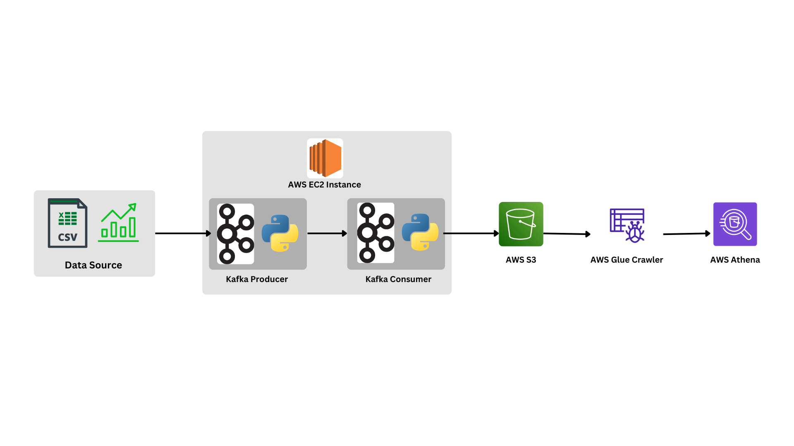

# Real-Time Stock Market Data Pipeline with Apache Kafka and AWS
This project demonstrates the setup of a real-time data pipeline using Apache Kafka to simulate real-world and real-time data by streaming stock market data, along with AWS services such as S3, Glue Crawler, and Athena for data storage and analysis.


## Project Overview
This project simulates a real-time stock market data stream using Kafka, where the data is streamed from a CSV file by a Kafka Producer. The Kafka Consumer listens to this data stream on a specific topic and stores it into an AWS S3 bucket. After the data is stored in S3, an AWS Glue Crawler is used to analyze the schema of the data, and AWS Athena can be used to query and analyze the data stored in S3.

## Key Technologies
- Kafka: Used as the data broker to stream and manage the real-time data.
- EC2: Used to run Kafka services including Zookeeper, Kafka Server, Kafka Producer, and Kafka Consumer.
- AWS S3: For storing the data streamed by Kafka.
- AWS Glue Crawler: To discover the schema of the data in S3.
- AWS Athena: For querying and analyzing the data stored in S3.

## Features
- Real-time stock market data simulation using Kafka Producer and Kafka Consumer.
- Data ingestion pipeline that streams data from a CSV file to Kafka and stores it in AWS S3.
- Schema discovery of the data using AWS Glue Crawler.
- SQL-like querying and analysis of the data using AWS Athena.

## Architecture Overview
- Kafka Producer: Reads stock market data from a CSV file and streams it into a Kafka topic.
- Kafka Broker: Manages the communication between Kafka Producer and Kafka Consumer.
- Kafka Consumer: Listens to the Kafka topic and writes the streamed data into an AWS S3 bucket.
- AWS S3: Acts as the storage layer for the streamed stock market data.
- AWS Glue Crawler: Analyzes the data in S3 to infer the schema.
- AWS Athena: Provides querying capabilities on the data stored in S3.

## Repository Structure

```
.
├── README.md				 # Project documentation (this file)
├── data
│   └── indexProcessed.csv
└── scripts
    ├── kafka-consumer.ipynb		 # Script to run Kafka Consumer
    ├── kafka-producer.ipynb		 # Script to run Kafka Producer
    ├── playground.py			 # Playground for testing
    └── tools
        ├── create-topic.sh		 # Bash script to create Kafka topic
        ├── playground.sh		 # Playground for bash scripts
        ├── run-all-services.sh		 # Bash script to run all services
        ├── run-server-and-zookeeper.sh	 # Bash script to run Kafka Server and Zookeeper
        ├── run-server.sh		 # Bash script to run Kafka Server 
        └── run-zookeeper.sh		 # Bash script to run Kafka Zookeeper
```

## Getting Started
### Prerequisites
- AWS Account (for S3, Glue Crawler, and Athena)
- An EC2 instance set up with Kafka and Zookeeper
- Python 3.9+
- Kafka and Zookeeper running on EC2
### Setup Instructions
1. Clone the repository:
```bash
git@github.com:sulaimanfawwazak/Data-Engineering-Kafka.git
cd <repository-folder>
```
2. Start Kafka and Zookeeper services: Run the following bash script to start Zookeeper, Kafka Server, Producer, and Consumer:
```bash
./run-all-services.sh --topic <topic_name> --ip <kafka_broker_ip>
```
3. Run Kafka Producer: The producer.py script streams data from the CSV file to a Kafka topic.

```bash
python3 producer.py
```
4. Run Kafka Consumer: The consumer.py script consumes the streamed data and uploads it to an S3 bucket.
```
python3 consumer.py
```
## Example Workflow
1. Start the Kafka services using the run-all-services.sh script.
2. The producer reads data from a stock market CSV file and streams it to the Kafka topic.
3. The consumer listens to the Kafka topic, retrieves the data, and stores it in an AWS S3 bucket.
4. Use AWS Glue Crawler to discover the schema of the data in S3.
5. Use AWS Athena to run SQL-like queries on the data.

## Future Improvements
- Implement real-time visualization of the streamed stock market data.
- Add support for scaling the Kafka cluster with multiple brokers.
- Explore additional AWS services for analytics and visualization (e.g., QuickSight).
